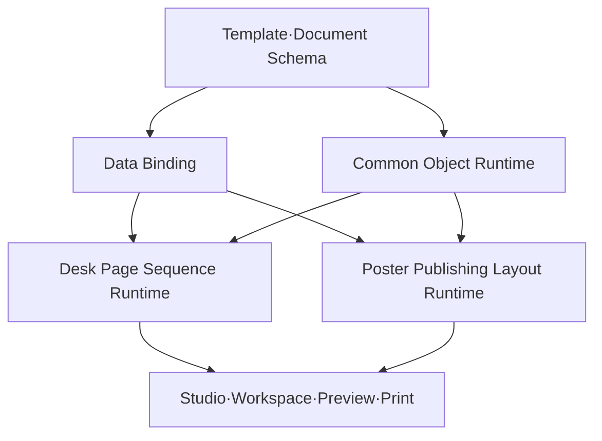

# ACDL v2 공통 Schema 및 Runtime 개편 명세

- 문서 상태: Draft 1
- 작성일: 2026-08-05
- 관련 문서: [`탁상형·벽보형 샘플 기능 매트릭스`](../product/02-V2-SAMPLE-FEATURE-MATRIX.md)

## 1. 목적

이 문서는 실제 탁상형·벽보형 샘플의 기능을 안정적으로 구현하기 위한 ACDL v2의 공통 데이터 구조와 Runtime 책임을 정의한다.

핵심 목표는 다음과 같다.

- Studio, Workspace, 미리보기, 출력이 하나의 Schema와 렌더링 규칙을 사용한다.
- 탁상형의 페이지 반복과 벽보형의 영역 기반 레이아웃을 공통 기반 위에서 분리한다.
- 일정 데이터, 표시 방식, 지면 배치를 서로 분리한다.
- 월별 복제 데이터와 화면별 임시 예외를 줄이고 상속·override 구조를 도입한다.
- 오버플로, 충돌, 저해상도, 페이지 누락을 출력 전에 검출한다.

## 2. 아키텍처 원칙

### 2.1 공통 기반과 제품 Runtime 분리



### 2.2 불변 원칙

1. Template은 디자인 구조와 편집 권한을 가진다.
2. Document는 학교·연도·일정·월별 콘텐츠 등 실제 제작 데이터를 가진다.
3. 일정 원본 데이터에는 특정 지면의 좌표를 저장하지 않는다.
4. 개체가 데이터를 어떤 표현으로 렌더링할지 결정한다.
5. 계산 결과와 임시 편집 상태는 원본 Schema와 분리한다.
6. 출력은 별도 구현이 아니라 동일 Runtime의 결정적 렌더링 결과를 사용한다.
7. 자동 조정은 적용 내역과 실패 상태를 반드시 반환한다.

## 3. 최상위 도메인 모델

```text
TemplateDefinition
├─ schemaVersion
├─ templateId
├─ metadata
├─ productType
├─ printSpecification
├─ academicCalendarDefaults
├─ schoolDataSchema
├─ styleTokens
├─ assetManifest
├─ capabilities
├─ masters
├─ pageComposition
└─ validationPolicy

CalendarDocument
├─ documentVersion
├─ templateRef
├─ academicCalendar
├─ schoolData
├─ calendarData
├─ contentAssets
├─ contentOverrides
├─ displayOverrides
└─ productionStatus
```

TemplateDefinition과 CalendarDocument를 분리함으로써 같은 학교 데이터와 일정을 여러 템플릿 또는 두 상품 유형에 재사용할 수 있다.

## 4. TemplateDefinition

### 4.1 기본 구조

```json
{
  "schemaVersion": "2.0.0",
  "templateId": "tpl_desk_001",
  "metadata": {
    "name": "탁상형 기본 플래너",
    "status": "draft",
    "createdAt": "2026-08-05T00:00:00Z",
    "updatedAt": "2026-08-05T00:00:00Z"
  },
  "productType": "desk",
  "printSpecification": {},
  "academicCalendarDefaults": {},
  "schoolDataSchema": {},
  "styleTokens": {},
  "assetManifest": [],
  "capabilities": {},
  "masters": [],
  "pageComposition": {},
  "validationPolicy": {}
}
```

### 4.2 `productType`

허용값:

- `desk`: 탁상형
- `poster`: 벽보형

상품 유형은 UI 표시용 메타데이터가 아니라 사용할 제품 Runtime과 수용 규칙을 결정한다.

### 4.3 `printSpecification`

```json
{
  "trimSize": { "widthMm": 260, "heightMm": 190 },
  "orientation": "landscape",
  "bleedMm": { "top": 3, "right": 3, "bottom": 3, "left": 3 },
  "safeAreaMm": { "top": 8, "right": 8, "bottom": 8, "left": 8 },
  "binding": {
    "type": "wire",
    "edge": "top",
    "reservedMm": 12
  },
  "colorMode": "CMYK",
  "minimumImageDpi": 200
}
```

좌표의 기준 공간은 재단 크기이며, 도련과 제본 예약 영역은 별도 속성으로 관리한다. 화면 픽셀을 원본 좌표로 저장하지 않는다.

### 4.4 `academicCalendarDefaults`

```json
{
  "startMonth": 3,
  "monthCount": 12,
  "weekStartsOn": "sunday",
  "locale": "ko-KR",
  "showLunarDates": false,
  "showSolarTerms": false,
  "holidayPolicy": "KR"
}
```

### 4.5 `schoolDataSchema`

```json
{
  "fields": [
    { "key": "school.name", "type": "text", "required": true },
    { "key": "school.nameEn", "type": "text" },
    { "key": "school.logo", "type": "image", "required": true },
    { "key": "school.exterior", "type": "image" },
    { "key": "school.address", "type": "text" },
    { "key": "school.phone.office", "type": "text" },
    { "key": "school.phone.admin", "type": "text" },
    { "key": "school.website", "type": "url" },
    { "key": "school.motto", "type": "richText" },
    { "key": "school.song.score", "type": "image" },
    { "key": "school.tree", "type": "entity" },
    { "key": "school.flower", "type": "entity" }
  ]
}
```

필드 키는 개체의 데이터 바인딩에서 사용한다. placeholder 문구는 편집 화면에서만 보일 수 있으며 실제 출력에는 데이터가 없을 때의 출력 정책을 적용한다.

### 4.6 `styleTokens`

```json
{
  "colors": {
    "primary": "#2457A7",
    "sunday": "#D94747",
    "saturday": "#3574C8",
    "text": "#222222"
  },
  "typography": {
    "body": { "fontFamily": "Pretendard", "fontSizePt": 9 },
    "calendarDate": { "fontFamily": "Pretendard", "fontSizePt": 10 }
  },
  "spacing": { "xs": 1, "sm": 2, "md": 4, "lg": 8 },
  "strokes": { "calendar": { "widthPt": 0.5, "color": "#B8BDC7" } }
}
```

개체 속성은 토큰을 참조하거나 명시적 값을 override할 수 있다.

### 4.7 `capabilities`

```json
{
  "workspace": {
    "canChangeStartMonth": true,
    "canAddCoverPages": true,
    "canChangeTheme": true
  },
  "objectDefaults": {
    "content": "editable",
    "style": "locked",
    "geometry": "locked",
    "visibility": "controlled"
  }
}
```

개체별 권한은 기본 capability를 override한다.

```json
{
  "permissions": {
    "content": "editable",
    "style": "limited",
    "geometry": "locked",
    "delete": false,
    "allowedStyleKeys": ["fill", "fontSize"]
  }
}
```

## 5. CalendarDocument

### 5.1 학사연도

```json
{
  "academicCalendar": {
    "academicYear": 2026,
    "startDate": "2026-03-01",
    "endDate": "2027-02-28",
    "startMonth": 3,
    "weekStartsOn": "sunday"
  }
}
```

### 5.2 일정 데이터

```json
{
  "calendarData": {
    "categories": [
      { "id": "school", "name": "학사일정", "color": "#6BBD8A" }
    ],
    "events": [
      {
        "id": "evt_001",
        "title": "학부모 상담주간",
        "startDate": "2026-03-09",
        "endDate": "2026-03-18",
        "allDay": true,
        "categoryId": "school",
        "display": {
          "shortLabel": "상담주간",
          "priority": 3,
          "color": "#6BBD8A"
        }
      }
    ]
  }
}
```

일정 원본에 다음을 저장하지 않는다.

- 특정 페이지 좌표
- 특정 월력 셀의 lane 번호
- 줄바꿈 결과
- 렌더링 과정에서 분할된 주간 segment

이 값은 Runtime이 계산한 파생 상태다.

### 5.3 콘텐츠와 표시 override

```json
{
  "contentOverrides": {
    "month:2026-03": {
      "heroImage": "asset_school_event_03",
      "monthlyMessage": "새 학년의 힘찬 시작"
    }
  },
  "displayOverrides": {
    "event:evt_001@object:calendar_main": {
      "label": "상담주간",
      "hidden": false
    }
  }
}
```

콘텐츠 override는 월별 사진·문구 같은 실제 콘텐츠 차이를, display override는 특정 표현 영역에서의 축약·숨김 등 표시 차이를 저장한다.

## 6. 페이지·마스터 모델

### 6.1 공통 페이지

```json
{
  "id": "page_001",
  "pageRole": "month-calendar",
  "masterRef": "master_month_calendar",
  "monthRange": { "start": "2026-03", "end": "2026-03" },
  "objects": [],
  "overrides": {}
}
```

권장 `pageRole`:

- `cover-front`
- `cover-inside`
- `yearly-calendar`
- `school-symbols`
- `month-back`
- `month-calendar`
- `poster-calendar`
- `school-information`
- `back-cover`
- `custom`

### 6.2 탁상형 `pageComposition`

```json
{
  "type": "desk-sequence",
  "sequence": [
    { "pageRole": "cover-front", "masterRef": "cover" },
    { "pageRole": "yearly-calendar", "masterRef": "year" },
    { "pageRole": "school-symbols", "masterRef": "symbols" },
    {
      "repeat": "academicMonths",
      "pair": [
        { "pageRole": "month-back", "masterRef": "month_back", "side": "back" },
        { "pageRole": "month-calendar", "masterRef": "month_front", "side": "front" }
      ]
    },
    { "pageRole": "back-cover", "masterRef": "back_cover" }
  ]
}
```

Runtime은 반복 항목에서 `monthKey`, `pairId`, `side`, 최종 페이지 순서를 생성한다.

### 6.3 벽보형 `pageComposition`

```json
{
  "type": "poster-layout",
  "pages": [
    {
      "pageRole": "poster-calendar",
      "monthRange": { "start": "2026-03", "end": "2026-08" },
      "layoutMode": "fixed-regions",
      "masterRef": "poster_semester"
    },
    {
      "pageRole": "poster-calendar",
      "monthRange": { "start": "2026-09", "end": "2027-02" },
      "layoutMode": "fixed-regions",
      "masterRef": "poster_semester"
    }
  ]
}
```

페이지 수와 학기 개념을 고정 enum으로 만들기보다 각 페이지의 월 범위를 명시한다.

## 7. 공통 개체 모델

### 7.1 기본 구조

```json
{
  "id": "obj_001",
  "type": "text",
  "name": "학교명",
  "frame": { "xMm": 10, "yMm": 10, "widthMm": 80, "heightMm": 12 },
  "rotationDeg": 0,
  "zIndex": 10,
  "visible": true,
  "style": {},
  "binding": {},
  "permissions": {},
  "validation": {}
}
```

### 7.2 공통 개체 유형

| 유형 | 책임 |
|---|---|
| `text` | 일반 텍스트 |
| `richText` | 문단·인라인 스타일 텍스트 |
| `imageFrame` | 이미지 크롭·초점·마스크 |
| `shape` | 사각형·원·배경 장식 |
| `line` | 구분선·가이드 표현 |
| `icon` | 벡터·아이콘 자산 |
| `dataField` | 학교 데이터 단일 필드 |
| `calendarGrid` | 월력 그리드와 일정 레이어 |
| `miniCalendar` | 축소 월력 |
| `yearCalendar` | 연간 월력 |
| `eventList` | 일정 목록과 흐름 |
| `table` | 구조화된 행·열 정보 |
| `group` | 복합 개체와 상대 좌표 |
| `repeater` | 데이터 목록·월 블록 반복 |
| `background` | 페이지 배경·도련 이미지 |

`MonthBlock`, `PhotoCollage`, `PlannerSection` 등은 사용자 관점에서는 삽입 블록이지만 내부적으로 위 공통 개체의 그룹·반복 구조로 저장하는 것을 기본 원칙으로 한다. 전용 동작이 필요한 경우에만 별도 Runtime 유형을 둔다.

## 8. Calendar Grid

### 8.1 설정

```json
{
  "type": "calendarGrid",
  "calendar": {
    "monthBinding": "context.month",
    "layoutMode": "boxedGrid",
    "weekStartsOn": "inherit",
    "weekRowPolicy": "auto",
    "showAdjacentMonthDates": true
  },
  "eventLayer": {
    "mode": "cellAndRange",
    "maxLanes": 3,
    "overflowPolicy": "warn",
    "rangeSplit": "byWeek"
  }
}
```

### 8.2 `layoutMode`

- `boxedGrid`: 명시적 셀 경계가 있는 7열×5~6주 구조
- `openRows`: 열린 셀 또는 가로선 중심 구조

두 모드는 동일한 날짜 계산 결과를 사용하고 시각적 렌더러만 달라진다.

### 8.3 기간 일정 배치

Runtime 처리 순서:

1. 이벤트를 표시 월 범위로 자른다.
2. 주 경계별 segment로 분할한다.
3. 각 segment의 시작·끝 열을 계산한다.
4. 우선순위·시작일·기간 길이 기준으로 정렬한다.
5. 기존 segment와 겹치지 않는 lane을 할당한다.
6. 최대 lane을 넘으면 overflow 상태를 생성한다.
7. segment 텍스트의 전체명·축약명·숨김 정책을 적용한다.

Runtime 결과 예:

```json
{
  "eventId": "evt_001",
  "weekIndex": 1,
  "startColumn": 1,
  "endColumn": 6,
  "lane": 0,
  "label": "상담주간",
  "continuesBefore": false,
  "continuesAfter": true
}
```

## 9. Event List와 Flow Layout

### 9.1 Event List

```json
{
  "type": "eventList",
  "source": "calendarData.events",
  "filter": { "month": "context.month" },
  "sort": ["startDate", "priority", "title"],
  "format": {
    "singleDate": "M.d. {title}",
    "dateRange": "M.d.~M.d. {title}"
  },
  "flow": {
    "columns": 1,
    "columnGapMm": 3,
    "overflowPolicy": "shrinkThenWarn"
  }
}
```

### 9.2 L2 자동 조정 순서

영역 크기는 유지하고 내부에서 다음 순서로 조정한다.

1. 기본 글자 크기·행간으로 배치
2. 허용 범위 내 행간 축소
3. 허용된 경우 다단 분할
4. 글자 크기를 단계적으로 축소
5. `minimumFontSizePt` 도달 후에도 넘치면 오류

조정 결과에는 적용 전후 값과 원인을 기록한다.

```json
{
  "status": "autoAdjusted",
  "adjustments": [
    { "property": "fontSizePt", "from": 8.5, "to": 7.5 }
  ],
  "overflow": false
}
```

## 10. Image Frame과 자산

### 10.1 Image Frame

```json
{
  "type": "imageFrame",
  "source": { "binding": "month.heroImage" },
  "fit": "cover",
  "focus": { "x": 0.5, "y": 0.45 },
  "cornerRadiusMm": 3,
  "maskRef": null,
  "emptyPolicy": "showEditorPlaceholder",
  "printEmptyPolicy": "hide"
}
```

학교 전경 같은 placeholder 라벨은 편집 보조 정보이며 출력 콘텐츠가 아니다.

### 10.2 Asset Manifest

```json
{
  "id": "asset_school_exterior",
  "scope": "school",
  "kind": "image",
  "mimeType": "image/jpeg",
  "sourceRef": "...",
  "metadata": {
    "widthPx": 4000,
    "heightPx": 3000,
    "colorProfile": "sRGB"
  }
}
```

`scope` 권장값:

- `system`
- `template`
- `school`
- `document`
- `month`

Runtime은 실제 인쇄 크기를 기준으로 유효 DPI를 계산해 경고한다.

## 11. 상속과 Override

### 11.1 적용 순서

```text
System defaults
→ Template style tokens
→ Master object properties
→ Seasonal theme
→ Monthly override
→ Document content override
→ Allowed user display override
```

뒤 단계가 앞 단계를 덮지만, 권한상 허용되지 않은 속성은 적용하지 않는다.

### 11.2 저장 원칙

- 최종 계산값 전체를 각 월 페이지에 복제하지 않는다.
- 원본과 다른 속성만 override로 저장한다.
- override 대상은 안정적인 `objectId`와 `monthKey`로 식별한다.
- 마스터 개체 삭제·변경 시 고아 override를 검출한다.

## 12. Runtime 구성

### 12.1 공통 Runtime

| 모듈 | 책임 |
|---|---|
| Schema Loader | 버전 검증·마이그레이션 |
| Calendar Engine | 날짜·주·공휴일 계산 |
| Binding Engine | 학교·일정·월별 데이터 해석 |
| Object Runtime | 공통 개체 측정·배치·렌더링 |
| Text Layout | 줄바꿈·측정·축소·오버플로 |
| Image Fitting | 크롭·초점·유효 DPI |
| Validation Engine | 편집·출력 오류 통합 |
| Render Adapter | Studio·Workspace·Preview·Print 대상 출력 |

### 12.2 탁상형 전용 Runtime

| 모듈 | 책임 |
|---|---|
| Page Sequence | 제품 순서에 따라 페이지 생성 |
| Month Pair | `pairId`와 앞뒤면 관계 유지 |
| Repeated Master | 월별 마스터 인스턴스 생성 |
| Monthly Override | 월별 콘텐츠·테마 차이 적용 |
| Imposition Guard | 출력 페이지 순서·누락 검사 |

### 12.3 벽보형 전용 Runtime

| 모듈 | 책임 |
|---|---|
| Region Layout | 대형 지면의 고정 영역 배치 |
| Month Block Repeater | 월 범위에 따른 블록 반복 |
| Event Flow | 월별·전체 일정 목록 흐름 |
| Range Event Layout | 주간 segment와 lane 계산 |
| Overflow Resolver | 축소·다단·오류 상태 생성 |
| Information Layout | 학교 현황·시간표·표 배치 |

## 13. 편집 상태와 영속 데이터 분리

다음 값은 문서에 영속 저장하지 않거나 별도 UI 상태로 저장한다.

- 현재 선택 개체
- 확대율과 스크롤 위치
- 열려 있는 Inspector 탭
- 드래그 중 임시 좌표
- hover·selection outline
- 계산된 텍스트 줄과 이벤트 segment
- 검증 패널의 펼침 상태

이 분리는 템플릿 변경 시 이전 편집 화면이 남는 상태 누수를 줄이는 기반이다. 편집 컨텍스트가 바뀌면 selection, draft, history scope, derived layout cache를 새 문서 기준으로 초기화한다.

## 14. 명령·History 경계

모든 영속 변경은 Command로 표현한다.

예:

- `UpdateObjectFrame`
- `UpdateObjectStyle`
- `ReplaceBoundAsset`
- `UpdateSchoolField`
- `AddCalendarEvent`
- `UpdateEvent`
- `ApplyMonthOverride`
- `ReorderPages`

Command는 다음을 제공해야 한다.

- 변경 전후 payload
- 대상 document·page·object 식별자
- undo·redo 가능 여부
- validation 재실행 범위
- collaboration·AI Edit에서 재사용 가능한 직렬화 형식

Editor State, Selection, Command, History, Undo/Redo, AI Edit, Collaboration, Persistence, Versioning의 전면 개편은 후속 Editor Architecture 과제로 두되, v2 Schema 변경은 이 구조와 충돌하지 않도록 한다.

## 15. 검증 모델

### 15.1 결과 구조

```json
{
  "code": "TEXT_MIN_FONT_VIOLATION",
  "severity": "error",
  "message": "일정 목록이 최소 글자 크기에서도 영역을 초과합니다.",
  "target": {
    "pageId": "page_002",
    "objectId": "event_list_09"
  },
  "details": {
    "minimumFontSizePt": 7,
    "requiredFontSizePt": 6.4
  }
}
```

### 15.2 주요 검증 코드

| 분류 | 예시 코드 | 심각도 |
|---|---|---|
| Schema | `SCHEMA_VERSION_UNSUPPORTED` | error |
| 데이터 | `REQUIRED_SCHOOL_FIELD_MISSING` | error·warning |
| 페이지 | `MONTH_PAIR_INCOMPLETE` | error |
| 페이지 | `ACADEMIC_MONTH_MISSING` | error |
| 텍스트 | `TEXT_OVERFLOW` | warning·error |
| 텍스트 | `TEXT_MIN_FONT_VIOLATION` | error |
| 일정 | `EVENT_LANE_OVERFLOW` | warning·error |
| 일정 | `EVENT_HIDDEN_BY_LIMIT` | warning |
| 이미지 | `IMAGE_EFFECTIVE_DPI_LOW` | warning·error |
| 인쇄 | `OBJECT_OUTSIDE_BLEED` | error |
| 인쇄 | `CONTENT_OUTSIDE_SAFE_AREA` | warning |
| 자산 | `ASSET_REFERENCE_MISSING` | error |
| override | `ORPHAN_OVERRIDE` | warning |

## 16. Schema 버전과 마이그레이션

### 16.1 정책

- `schemaVersion`은 Semantic Versioning 형식을 사용한다.
- major 변경은 자동 변환 불가능한 구조 변경이다.
- minor 변경은 기본값을 보충해 호환 가능한 기능 추가다.
- patch 변경은 의미를 바꾸지 않는 수정이다.

### 16.2 로딩 과정

1. 원본 파일 보존
2. Schema 버전 판독
3. 단계별 migration 적용
4. 구조 validation
5. 참조 무결성 검사
6. migration report 생성
7. 사용자가 저장할 때만 최신 형식으로 영속화

구버전 템플릿을 불러오는 순간 원본을 조용히 덮어쓰지 않는다.

## 17. 단계별 구현 경계

### Phase 1 — Schema Foundation

- TemplateDefinition과 CalendarDocument 분리
- 상품·인쇄·학사연도 Schema
- 학교 데이터와 일정 Schema
- 공통 개체 frame·style·binding·permissions
- 버전 로더와 기본 validation

### Phase 2 — Common Rendering

- Calendar Engine 단일화
- Text Layout과 오버플로 감지
- Image Frame과 자산 바인딩
- Calendar Grid `boxedGrid`
- Studio·Workspace·Preview 동일 렌더링 경로

### Phase 3 — Desk Runtime

- Page Sequence와 Month Pair
- 월별 반복 마스터
- 플래너 뒷면
- 월별 override
- 페이지·출력 검사

### Phase 4 — Poster Runtime

- Month Block과 Event List
- 셀 내부 일정과 기간 막대
- lane 충돌과 여러 주 분할
- Table·Information Block
- 자동 축소와 다단 흐름

### Phase 5 — Production Hardening

- 대형 지면 출력
- 이미지 유효 DPI와 누락 자산 검사
- 구버전 migration
- 대표 샘플 회귀 테스트
- 우리학교인쇄 전달용 최종 파일 검증 경계

## 18. 테스트 전략

### 18.1 단위 테스트

- 학사연도 시작월과 윤년
- 5주·6주 월 계산
- 일·월요일 시작
- 기간 일정의 월·주 경계 분할
- lane 충돌 배치
- 텍스트 최소 크기와 오버플로
- 이미지 유효 DPI
- 상속·override 적용 순서

### 18.2 Golden Rendering

대표 샘플의 주요 페이지를 고정 입력으로 렌더링하고 기준 이미지와 비교한다.

- 탁상형: 표지, 학교 상징, 3월 뒷면, 3월 월력, 6주 월력, 뒷표지
- 벽보형: 일정 적은 월, 일정 많은 월, 기간 일정 겹침, 학교 현황 표, 2페이지 구성

### 18.3 통합 테스트

1. Studio에서 템플릿 생성·저장
2. Workspace에서 템플릿 선택
3. 학교정보·일정·사진 입력
4. 편집 종료 후 재진입
5. 미리보기와 출력 생성
6. 페이지·오버플로·해상도 검증
7. 다른 템플릿 선택 시 이전 상태 누수 없음 확인

## 19. 코드 대조 시 조사 항목

현재 저장소를 검토할 때 다음 순서로 확인한다.

1. 현재 저장 포맷과 Schema 진입점
2. Calendar Engine의 중복 구현 여부
3. Studio·Workspace·미리보기·출력의 렌더러 공유 여부
4. 페이지 역할·월별 반복·앞뒤 페어 표현 방식
5. 기간 일정 분할과 충돌 처리 위치
6. 텍스트 측정과 글자 크기 적용 경로
7. 이미지 크롭·자산 참조·출력 해상도 처리
8. 선택·history·draft·cache 초기화 경계
9. 시스템 템플릿과 사용자 템플릿의 권한 차이
10. 최종 출력 파일 생성과 우리학교인쇄 전달 경계

각 모듈은 `유지 / 보강 / 교체 / 신규` 중 하나로 판정하고, 판정 근거와 회귀 위험을 기록한다.

## 20. 이번 명세에서 확정하는 결정

1. Template과 실제 제작 Document를 분리한다.
2. 일정 데이터와 표시 위치·형식을 분리한다.
3. 공통 Calendar Engine과 Object Runtime을 사용한다.
4. 탁상형은 `desk-sequence`, 벽보형은 `poster-layout` Runtime을 사용한다.
5. 탁상형 월별 페이지는 마스터+반복+override로 생성한다.
6. 벽보형 v2 자동 레이아웃 완료선은 고정 영역 내부의 축소·다단·오버플로 검출(L2)이다.
7. 출력 placeholder와 편집 안내 UI를 분리한다.
8. 겹침은 허용하고 명시적 z-order를 사용한다.
9. 자동 레이아웃 결과는 조용히 콘텐츠를 누락하지 않고 상태와 검증 결과를 반환한다.
10. Studio, Workspace, 미리보기, 출력은 동일한 Schema와 Runtime을 공유한다.

## 21. 보류된 후속 설계

다음은 중요하지만 이번 v2 기반 명세에서 상세 구현을 확정하지 않는다.

- L3 Publishing Geometry Runtime: 영역 간 자동 재배치, 페이지 넘김, 반응형 인쇄 레이아웃
- 고급 Text Layout: 복잡한 문단 조판, 서체 fallback, 세밀한 금칙 처리
- Editor Architecture 전면 개편: Selection, Command Bus, History, AI Edit, Collaboration, Persistence, Versioning
- 실시간 공동편집 충돌 해결
- 일반 달력·문집·보고서로의 제품 확장
- 인쇄소별 자동 imposition 및 생산 API 통합

이 항목들은 현재 구조가 확장 가능하도록 경계를 남기되 v2 대표 샘플 완료를 지연시키지 않는다.
