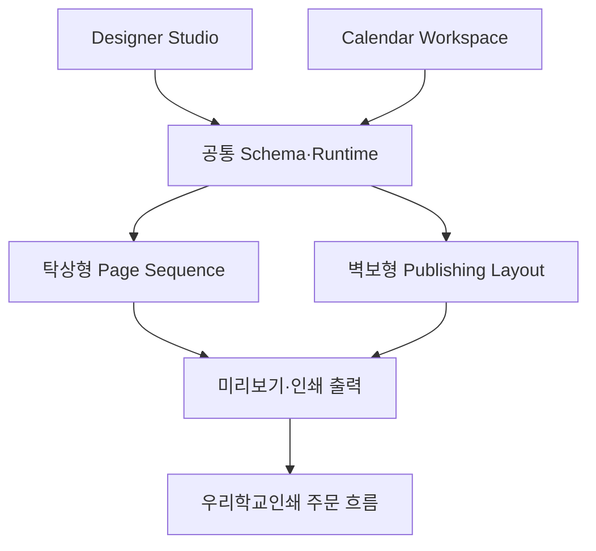

# 학사달력 에디터 서비스 전체 개발 방향

- 문서 상태: 기준 초안
- 작성일: 2026-08-05
- 대상: 제품 기획, 디자인, 개발, 사용자 검증, 우리학교인쇄 연동

## 1. 이 문서의 역할

이 문서는 학사달력 에디터 서비스가 무엇을 만들고, 어떤 순서와 원칙으로 완성할지를 한곳에 정리한 상위 기준이다.

세부 기능 범위는 [탁상형·벽보형 샘플 기능 매트릭스](./02-V2-SAMPLE-FEATURE-MATRIX.md), 구현 구조는 [v2 공통 Schema 및 Runtime 개편 명세](../architecture/04-V2-SCHEMA-RUNTIME-SPEC.md)를 따른다. 두 문서가 세부 판단을 담당하고, 이 문서는 제품 전체의 방향과 단계 경계를 담당한다.

## 2. 제품 목표

학교가 직접 복잡한 출판 디자인을 처음부터 만들지 않아도, 검증된 템플릿에 학교 정보·학사일정·사진을 적용해 인쇄 가능한 학사달력을 완성하도록 한다.

이를 위해 하나의 서비스가 아니라 다음 세 영역을 연결한다.

1. **Designer Studio**: 관리자·디자이너가 재사용 가능한 템플릿을 제작하고 검증한다.
2. **Calendar Workspace**: 학교 사용자가 템플릿을 선택하고 학교 데이터와 콘텐츠를 적용한다.
3. **Preview·Publishing**: 같은 결과를 사용자 검토 화면과 최종 인쇄 파일에서 일관되게 만든다.

완성된 인쇄 파일은 우리학교인쇄에 전달되어 견적·주문·결제·인쇄·배송 흐름으로 이어진다.

## 3. 현재 제품 범위

### 이번 제품에서 지원하는 상품

- 탁상형 학사달력
- 벽보형 학사달력

상품 수를 계속 늘리기보다 실제 샘플에서 확인된 구성 요소와 배치 방식을 안정적으로 지원하는 것을 우선한다.

### 현재 범위에서 제외하거나 뒤로 미루는 항목

- 일반 달력 및 다른 출판물 제품화
- 완전한 자유형 범용 디자인 도구
- 멀티테넌트 SaaS 운영 구조
- 실시간 공동 편집
- AI 자동 디자인·자동 편집
- 우리학교인쇄의 회원·주문·결제·배송 기능 자체

장기적으로 학교문집, 학교신문, 보고서 등으로 확장할 수 있지만, 공통 기반이 학사달력에서 충분히 검증된 뒤 진행한다.

## 4. 사용자와 책임 경계

| 영역 | 주 사용자 | 책임 |
|---|---|---|
| Designer Studio | 관리자·디자이너 | 상품 규격, 페이지 구조, 개체, 바인딩, 사용자 편집 허용 범위, 템플릿 배포 |
| Calendar Workspace | 학교 사용자 | 학교정보, 일정, 사진, 허용된 문구·옵션 입력, 결과 검토 |
| Preview Workspace | 내부 검수자·테스터 | 실제 사용자 조건으로 템플릿 동작과 출력 위험 검증 |
| Publishing Runtime | 시스템 | 화면과 인쇄 출력에 사용할 동일한 해석 결과 생성, 오류 검사 |
| 우리학교인쇄 | 기존 서비스 | 사용자 진입, 가격 산정, 주문, 결제, 인쇄소 전달, 운영 배포 |

원칙적으로 디자인 구조는 Studio가 소유하고, 학교별 콘텐츠는 Workspace가 소유한다. Workspace는 템플릿이 허용한 범위 안에서만 구조를 변경한다.

## 5. 두 상품의 개발 방향

### 탁상형

탁상형은 반복 페이지 생성 시스템으로 본다.

- 표지·연력·학교상징·월별 앞뒤면·뒷표지의 의미를 명시한다.
- 월별 앞면과 뒷면을 하나의 페어로 관리한다.
- 월별 디자인 차이는 페이지 복제가 아니라 기본 스타일과 월별 변경값으로 관리한다.
- 월력은 줄형과 박스형 표현을 지원한다.
- 뒷면은 사진 콜라주, 띠력, 플래너, 메모 등 조합 가능한 반복 페이지로 구성한다.

### 벽보형

벽보형은 제한된 대형 지면에 월력·일정·학교 운영정보를 조합하는 출판 레이아웃 시스템으로 본다.

- 월력과 월별 일정 목록을 결합한 월 블록을 지원한다.
- 셀 내부 일정, 기간 막대, 별도 일정 목록을 서로 다른 표시 방식으로 처리한다.
- 학기 분할, 사용자 지정 월 범위, 1·2페이지 구성을 지원할 수 있어야 한다.
- 학교 현황, 일과표, 방과후 시간표 같은 구조화된 정보도 정식 구성 요소로 인정한다.
- 글자 축소, 다단 배치, 공간 초과 경고를 단계적으로 도입한다.

탁상형과 벽보형은 학교 데이터·일정·개체·출력 기반은 공유하되, 페이지 생성과 일정 배치 방식은 별도 Runtime으로 유지한다.

## 6. 변하지 않는 설계 원칙

1. Template과 학교별 Calendar Document를 분리한다.
2. 일정 데이터와 일정 표시 방식을 분리한다.
3. Studio, Workspace, 미리보기, 인쇄 출력은 같은 Schema와 Runtime을 사용한다.
4. 화면 미리보기와 최종 출력이 서로 다른 계산 결과를 만들지 않는다.
5. 학교정보·교표·전경·학사일정은 바인딩 가능한 구조화 데이터로 관리한다.
6. 이미지 교체, 크롭, 초점, 해상도 검사를 공통 이미지 프레임 기능으로 제공한다.
7. 템플릿은 사용자가 바꿀 수 있는 항목과 잠긴 디자인을 명시한다.
8. 자동 배치에는 항상 공간 초과 감지와 출력 검사가 따라야 한다.
9. 시스템 기본 템플릿과 사용자 템플릿의 편집·삭제 정책을 구분한다.
10. 이전 템플릿은 Schema 버전과 마이그레이션 규칙으로 보호한다.

## 7. 공통 기술 기반

공통 기반은 다음 순서로 강화한다.

- 학교 데이터와 학사연도 모델
- 단일·기간 일정 Schema
- Calendar Grid와 Event List
- 텍스트 줄바꿈·축소·공간 초과 검사
- 이미지 프레임과 자산 연결
- 스타일 토큰과 월별 변경값
- 화면·SVG·PDF가 공유하는 출력 모델
- 재단선, 안전영역, 출혈, DPI, 폰트 검사

## 8. 단계별 개발 계획

### 단계 1. 현재 구현 안정화

- 새 달력 만들기와 템플릿 만들기 흐름 안정화
- 템플릿 전환 시 이전 편집 상태가 남는 문제 제거
- 버튼, 상단 메뉴, 미리보기 등 공통 UI 정리
- 일반 텍스트 스타일 반영, 개체 겹침·레이어 동작 수정
- 시스템 기본 템플릿의 편집·삭제 정책 정리
- 기존 자동 검사를 유지하고 회귀 테스트 보강

완료 기준은 대표 흐름을 반복해도 상태가 섞이지 않고 기존 기능이 깨지지 않는 것이다.

### 단계 2. v2 공통 계약 정비

- Template Definition과 Calendar Document 분리
- 학교 데이터·일정·자산 Schema 확정
- 개체, 바인딩, 권한, 버전 규칙 확정
- 기존 코드와 명세를 `유지·보강·교체·신규`로 분류
- 기존 템플릿 마이그레이션 방안 마련

이 단계가 끝나기 전에는 유형별 기능을 임시 구조로 계속 덧붙이지 않는다.

### 단계 3. 탁상형 대표 샘플 구현

1. 박스형 월력과 플래너가 있는 대표 샘플
2. 이미지 콜라주와 띠력이 있는 대표 샘플
3. 앞뒤면 페어, 월별 테마, 이미지 교체 검증
4. 28페이지 순서와 인쇄 페이지 검사

### 단계 4. 벽보형 대표 샘플 구현

1. 월력+월별 일정 목록형
2. 셀 내부 단일 일정
3. 기간 일정 막대와 여러 주 분할
4. 다중 일정 충돌 처리
5. 학교 현황·시간표와 2페이지 구성
6. 글자 자동 축소·다단·공간 초과 경고

### 단계 5. Calendar Workspace 통합

- 템플릿 선택과 초기 설정
- 학교정보·일정·이미지 입력
- 템플릿 권한에 따른 편집 가능 범위 적용
- 저장·재진입·버전 호환
- Studio와 동일한 Runtime 결과 확인

### 단계 6. 인쇄 출력과 우리학교인쇄 연동

- 실제 PDF 생성
- 재단·안전영역·출혈·DPI·폰트 검사
- 가격 산정에 필요한 상품·규격·페이지 정보 전달
- 완성 파일의 안전한 전달과 주문 연결
- 독립 환경에서 충분히 검증한 뒤 우리학교인쇄 운영 서버에 배포

운영 인증, 주문, 결제, 개인정보, 파일 보관 기간과 인쇄소 전달 규칙은 기존 우리학교인쇄 시스템 담당자와 계약을 확정한 뒤 연결한다.

## 9. MVP 완료 기준

MVP는 기능 목록이 많다는 이유가 아니라 다음 흐름이 끊김 없이 동작할 때 완료로 본다.

1. 디자이너가 대표 탁상형·벽보형 템플릿을 만들고 배포한다.
2. 학교 사용자가 템플릿을 선택한다.
3. 학교정보·학사일정·사진을 입력한다.
4. 일정량과 이미지 상태에 따른 경고를 확인하고 수정한다.
5. 화면 미리보기와 인쇄 결과가 동일한 구조를 유지한다.
6. 인쇄 가능한 파일을 생성한다.
7. 우리학교인쇄가 상품·가격 정보와 파일을 받아 주문을 이어간다.

대표 샘플 하나만 우연히 동작하는 것이 아니라, 같은 유형의 다른 샘플에도 공통 구조를 재사용할 수 있어야 한다.

## 10. 품질과 변경 관리

- 새 기능마다 대표 정상 사례, 경계 사례, 실패 사례를 자동 검사에 추가한다.
- 템플릿 저장과 불러오기 후 결과가 달라지지 않아야 한다.
- 다른 템플릿으로 이동할 때 선택·페이지·편집 상태가 누출되지 않아야 한다.
- 최소 글자 크기, 이미지 해상도, 잘림, 충돌, 페이지 누락을 출력 전에 검사한다.
- 기존 사용자 변경과 관련 없는 파일을 함께 수정하지 않는다.
- 구조 변경은 문서의 Schema 버전과 변경 이력에 먼저 반영한다.

## 11. 후속 핵심 과제

MVP 이후에는 다음 두 영역을 별도 프로젝트 수준으로 다시 설계한다.

### Publishing Geometry Runtime

Constraint Layout, Flow Layout, Calendar Grid, Text Layout, Image Fitting, Collision Detection, Auto Resize, Responsive Print Layout을 하나의 일관된 배치 체계로 발전시킨다.

### Editor Architecture

Editor State, Selection, Command, History, Undo/Redo, AI Edit, Collaboration, Persistence, Versioning을 장기 확장이 가능한 편집 기반으로 정비한다.

현재 개발에서는 이 두 영역의 경계를 흐리지 않되, MVP 구현이 이후 재설계를 막는 임시 구조를 만들지 않는 것을 원칙으로 한다.

## 12. 문서 운영 원칙

- 전체 방향이 바뀌면 이 문서를 먼저 갱신한다.
- 실제 제품 샘플에서 새로운 패턴이 확인되면 기능 매트릭스를 갱신한다.
- 데이터 구조나 Runtime 계약이 바뀌면 Schema·Runtime 명세와 버전을 갱신한다.
- 구현 순서가 바뀌면 `ROADMAP.md`를 갱신한다.
- 확정되지 않은 아이디어와 확정된 기준을 같은 표현으로 기록하지 않는다.

이 문서를 기준으로 다음 작업은 현재 저장소의 모듈을 `유지·보강·교체·신규`로 판정하고, 단계 1의 안정화 항목과 단계 2의 구조 정비가 어디에서 만나는지 구체화하는 것이다.
